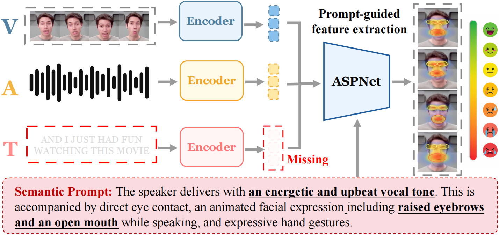
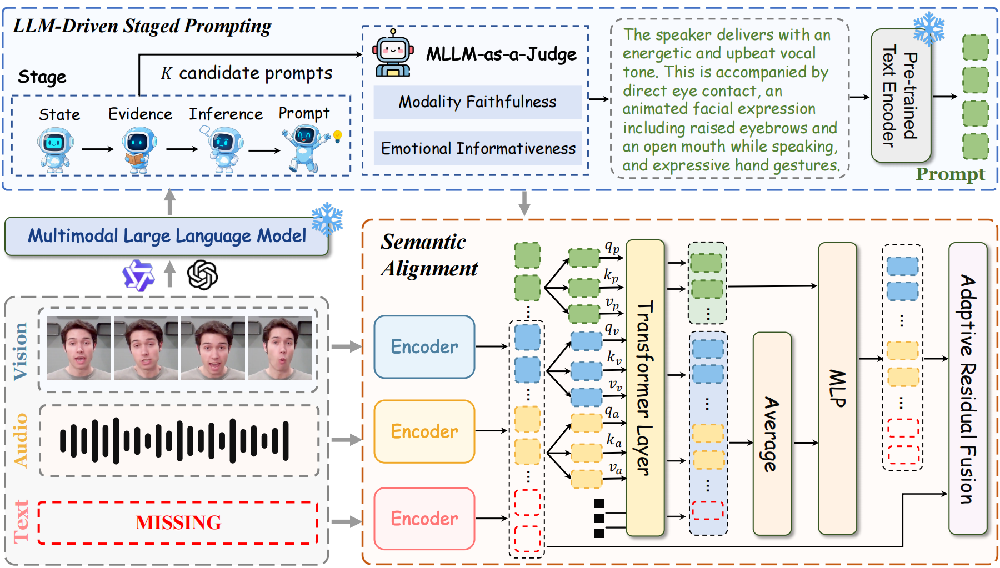
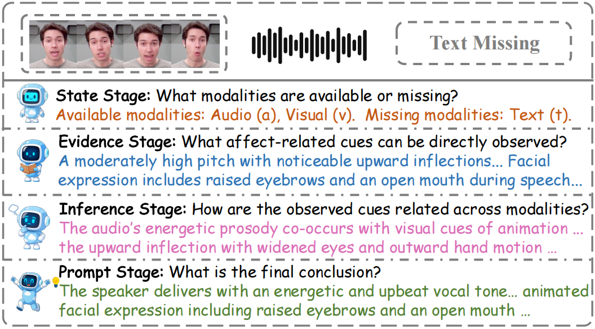
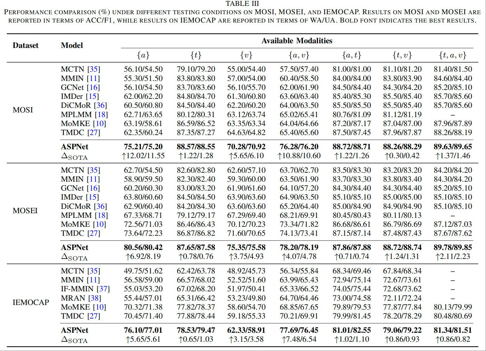
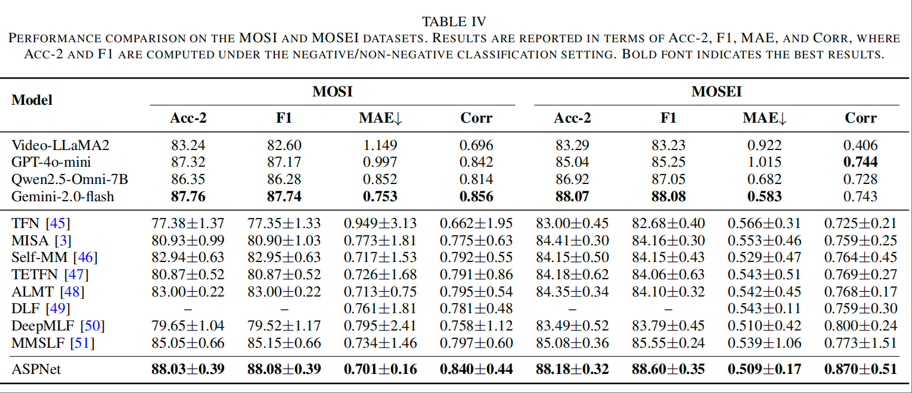

<a id="top"></a>
<div align="center">
  ,
  <h1>ASPNet: Bridging Low-Level Observation and High-Level Affective Prior for Incomplete Multimodal Learning</h1>
  <div>
    <a target="_blank" href="#">Wenhao&#160;Li</a><sup>1,2</sup>,
    <a target="_blank" href="#">Zhibin&#160;Wu</a><sup>1</sup>,
    <a target="_blank" href="#">Qiangchang&#160;Wang</a><sup>1</sup>,
    <a target="_blank" href="#">Pu&#160;Wang</a><sup>2,3</sup>,
    <a target="_blank" href="#">Yilong&#160;Yin</a><sup>1</sup>,
    <a target="_blank" href="https://liqiangnie.github.io">Liqiang&#160;Nie</a><sup>4</sup>
  </div>
  <sup>1</sup>School of Software, Shandong University &#160;&#160;&#160;<br>
  <sup>2</sup>Shenzhen Loop Area Institute &#160;&#160;&#160;<br>
  <sup>3</sup>School of Mathematics, Shandong University &#160;&#160;&#160;<br>
  <sup>4</sup>School of Computer Science and Technology, Harbin Institute of Technology (Shenzhen) &#160;&#160;&#160;<br>
  <br />
  <p>
    <a href=""></a>
    <a href=""></a>
    <a href="https://pytorch.org/get-started/locally/"></a>
    
    <a href="https://github.com/iLearn-Lab/ASPNet"></a>
  </p>
  <p>
    <b>Official Implementation:</b> An affective semantic prompting framework that uses a frozen Multimodal Large Language Model (MLLM) as an offline semantic generator, bridging low-level observation and high-level affective prior for robust incomplete multimodal learning.
  </p>
</div>

## 📌 Introduction
Welcome to the official repository for **ASPNet** (Affective Semantic Prompting Network).

In real-world deployments, modalities are frequently unavailable, corrupted, or withheld for privacy, and existing multimodal models degrade sharply under such incomplete observations. Prior work for Multimodal Sentiment Analysis (MSA) and Multimodal Emotion Recognition (MER) typically reconstructs missing features or introduces generic learnable prompts, but both operate in the low-level feature space without explicit high-level semantic constraints. **ASPNet** instead exploits the observation that affective semantics are *redundantly expressed across modalities*: it uses a frozen MLLM as an offline semantic generator to derive sample-specific affective prompts from whatever modalities remain observable, and a lightweight Semantic Alignment Network to inject these high-level priors into the available modality representations. Across three standard MSA and MER benchmarks, ASPNet outperforms strong prior methods under both incomplete and complete settings, with the largest gains arising precisely when low-level evidence is most scarce.

<div align="center">
<p align="center">
  

<strong>Figure 1.</strong> Intuition of ASPNet under missing-modality scenarios. When the textual modality is missing, models may fail to capture reliable affective representations from implicit visual and acoustic evidence alone. ASPNet derives sample-specific semantic prompts from the observed modalities to provide high-level affective priors (e.g., energetic vocal tone) that guide feature extraction toward intrinsic affect-relevant features.
</p>
</div>

[⬆ Back to top](#top)

## 📢 News
* **[YYYY-MM-DD]** 🚀 We officially release the code and framework of ASPNet!
* **[YYYY-MM-DD]** 🎉 ASPNet has been accepted by **<venue>**!

[⬆ Back to top](#top)

## ✨ Key Features
ASPNet introduces an MLLM-driven prompting pipeline and a lightweight alignment network to complement low-level features with high-level affective priors:

* 🧠 **Frozen MLLM as an Offline Semantic Generator**: Rather than tuning or deploying an MLLM on the prediction path, ASPNet queries a frozen MLLM (Qwen2.5-Omni-7B) **once per sample, fully offline**, and caches the resulting prompt. No MLLM is invoked during downstream training or inference on cached samples.
* 🪜 **MLLM-Driven Staged Prompting**: A structured four-stage reasoning procedure — `STATE → EVIDENCE → INFERENCE → PROMPT` — that grounds each prompt in observable evidence and constrains the MLLM to the available modality condition.
* ⚖️ **Candidate Selection via MLLM-as-a-Judge**: Generates *K* = 3 candidate prompts per sample and selects the best one by modality faithfulness, affective informativeness, compactness, and absence of missing-modality hallucination.
* 🔗 **Semantic Alignment Network**: Injects prompts at two complementary granularities — token-level interaction (TI) via self-attention and channel-level interaction (CI) via channel-wise modulation — with an adaptive gated residual fusion to inject semantics selectively.
* 🏆 **State-of-the-Art Robustness**: Strong improvements under severely incomplete conditions (e.g., audio- or visual-only) while remaining competitive under the complete-modality setting.

[⬆ Back to top](#top)

## 🏗️ Architecture

<p align="center">
  
  <figcaption><strong>Figure 2.</strong> Overview of ASPNet. Affective semantic prompts are first derived from observable modalities through offline MLLM-driven staged prompting; a lightweight Semantic Alignment mechanism then incorporates them into multimodal representations through token-level interaction and channel-wise semantic complementation, and the original and enhanced features are adaptively fused for prediction.</figcaption>
</p>

<p align="center">
  
  <figcaption><strong>Figure 3.</strong> An example of the four-stage structured prompting generation process (STATE → EVIDENCE → INFERENCE → PROMPT).</figcaption>
</p>

[⬆ Back to top](#top)

## 📊 Experiment Results

ASPNet is evaluated on CMU-MOSI, CMU-MOSEI, and IEMOCAP under a fixed missing-modality protocol with seven modality conditions ({a}, {t}, {v}, {a,v}, {a,t}, {t,v}, {a,t,v}).

> 📌 *Result tables/figures will be added here.*

<!--
<div align="center">
  
  
</div>
-->

[⬆ Back to top](#top)

---

## 📑 Table of Contents

- [📌 Introduction](#-introduction)
- [📢 News](#-news)
- [✨ Key Features](#-key-features)
- [🏗️ Architecture](#️-architecture)
- [📊 Experiment Results](#-experiment-results)
- [📂 Repository Structure](#-repository-structure)
- [🚀 Installation](#-installation)
- [📂 Data Preparation](#-data-preparation)
- [🏃‍♂️ Quick Start](#️-quick-start)
  - [1. Prompt Generation](#1-prompt-generation)
  - [2. Prompt Feature Extraction](#2-prompt-feature-extraction)
  - [3. Training](#3-training)
- [🤝 Acknowledgements](#-acknowledgements)
- [✉️ Contact](#️-contact)
- [📝 Citation](#-citation)

---

## 📂 Repository Structure

```text
ASPNet/
├── aspnet/
│   ├── datasets.py          # 📚 Dataset loader and preprocessing
│   ├── losses.py            # 📉 Task and alignment losses
│   ├── model.py             # 🧠 ASPNet model architecture and forward pass
│   ├── modalities.py        # 🎛️ Modality-availability handling
│   ├── utils.py             # 🛠️ Utility functions
│   └── modules/
│       └── attention.py     # 🔗 Token-level / channel-level interaction modules
├── prompts/
│   ├── generate_prompts.py  # 🪜 MLLM-driven staged prompt generation
│   └── extract_features.py  # 🔢 Encode prompts into .npy feature files
├── scripts/                 # 📜 Example shell scripts for common runs
├── config.py                # ⚙️ Dataset paths and configuration
├── train.py                 # 🚀 Training / evaluation entry point
└── README.md                # 📝 Documentation
```

[⬆ Back to top](#top)

## 🚀 Installation

**1. Clone the repository**
```bash
git clone https://github.com/iLearn-Lab/ASPNet.git
cd ASPNet
```

**2. Setup Environment**
We recommend using Conda to manage your environment:
```bash
conda create -n aspnet_env python=3.8
conda activate aspnet_env

# Install PyTorch (ensure it matches your CUDA version; experiments were run on an NVIDIA H100 GPU)
pip install torch torchvision torchaudio
pip install -r requirements.txt
```

[⬆ Back to top](#top)

## 📂 Data Preparation

ASPNet is evaluated on **CMU-MOSI**, **CMU-MOSEI**, and **IEMOCAP**. The default dataset layout is:

```text
dataset/
├── CMU-MOSI/
├── CMU-MOSEI/
└── IEMOCAP/
```

Dataset paths can be adjusted in `config.py`.

**Multimodal features** are extracted following prior work:
- **Acoustic**: pre-trained `wav2vec-large` → 512-dim utterance-level features.
- **Visual**: MTCNN face alignment + pre-trained `MA-Net` → 1024-dim utterance-level features.
- **Textual**: pre-trained `DeBERTa-large` → 1024-dim utterance-level features.

[⬆ Back to top](#top)

## 🏃‍♂️ Quick Start

The full pipeline has three steps: **(1) generate affective semantic prompts offline → (2) extract prompt features → (3) two-stage training**. Prompt features are aligned with multimodal representations only in the second training stage.

### 1. Prompt Generation

Prompt generation uses four MSA-specific stages:
```text
STATE → EVIDENCE → INFERENCE → PROMPT
```
`STATE` records modality availability, `EVIDENCE` extracts affective cues from available modalities, `INFERENCE` estimates sentiment tendency and cross-modal relations, and `PROMPT` produces the final text used for feature extraction. Multiple candidates can be generated for a selected stage and judged automatically (MLLM-as-a-Judge).

```bash
python -u prompts/generate_prompts.py \
  --dataset CMU-MOSI \
  --split train \
  --condition atv \
  --output-path prompt_outputs/train_audio_text_visual_fixed.jsonl \
  --raw-data-dir /path/to/raw/videos \
  --model-path /path/to/omni-model \
  --num-candidates 3 \
  --candidate-stage PROMPT
```

For text-only prompt generation, `--raw-data-dir` is not required. For audio or visual conditions, provide the dataset raw video directory.

```bash
python -u prompts/generate_prompts.py \
  --dataset IEMOCAP \
  --iemocap-classes 4 \
  --split train \
  --condition t \
  --output-path prompt_outputs/iemocap4_train_text_fixed.jsonl \
  --model-path /path/to/omni-model
```

### 2. Prompt Feature Extraction

Generated prompts are encoded with the same textual encoder as the lexical modality (DeBERTa-large), so the prompt representation lies in the same semantic space as the features it guides.

```bash
python -u prompts/extract_features.py \
  --dataset CMU-MOSI \
  --prompt-dir prompt_outputs \
  --conditions a t v at av tv atv \
  --model-path /path/to/deberta-large \
  --batch-size 32 \
  --max-length 48 \
  --pooling mean
```

### 3. Training

```bash
python -u train.py \
  --dataset CMU-MOSI \
  --audio-feature wav2vec-large-c-UTT \
  --text-feature deberta-large-4-UTT \
  --video-feature manet_UTT \
  --prompt-feature auto \
  --test_condition atv \
  --batch-size 32 \
  --epochs 150 \
  --stage_epoch 150 \
  --gpu 0
```

> ⚙️ **Per-dataset settings (from the paper).** Hidden dimension `d` and the maximum number of epochs for both pre-training and second-stage training are: **IEMOCAP** `d=256`, `epochs=50`; **CMU-MOSI** `d=128`, `epochs=150`; **CMU-MOSEI** `d=256`, `epochs=100`. The Semantic Alignment Network uses four stacked self-attention blocks (two heads each), dropout `0.5`, Adam with learning rate `1e-4` and weight decay `1e-5`, batch size `32`.

**Training pipeline:**
1. **First stage** — train audio, text, and visual experts on complete modalities.
2. **Expert selection** — select the best first-stage expert states on the validation split.
3. **Second stage** — train the fused predictor under the requested modality condition, aligning cached prompt features with the available modality representations.
4. **Model selection** — select the best epoch on the validation split.
5. **Final report** — evaluate the selected model on the test split.

Example shell scripts for common runs are provided under `scripts/`.

[⬆ Back to top](#top)

## 🤝 Acknowledgements

This project builds upon recent advances in incomplete multimodal learning and affective computing, and on the prompting capabilities of Multimodal Large Language Models. We thank the open-source community, and the authors of the datasets and pre-trained feature extractors used in this work.

[⬆ Back to top](#top)

## ✉️ Contact

If you have any questions, feel free to [open an issue](https://github.com/iLearn-Lab/ASPNet/issues) or reach out to the corresponding authors.

[⬆ Back to top](#top)


[⬆ Back to top](#top)
